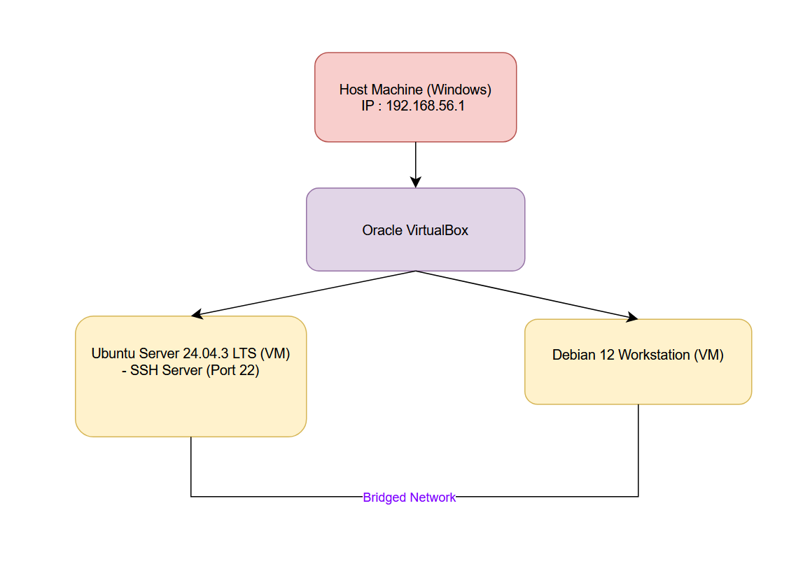

1. System Architecture Diagram

The project uses a small virtualised environment built on my Windows laptop.
The setup contains one server VM (Ubuntu Server 24.04.3 LTS) and one workstation VM (Debian 13 “Trixie”), both running inside VirtualBox with bridged networking enabled.
This allows all machines to obtain real LAN IP addresses from my router and communicate with each other as if they were physical devices on the same network.

Architecture Overview:

Host Machine (Windows laptop)

Runs VirtualBox

Used for managing both VMs

Connected to local LAN (e.g. 192.168.1.x)

Server VM – Ubuntu Server 24.04.3 LTS

IP Address: 192.168.1.221

Services installed: OpenSSH, Apache2, UFW firewall, Fail2Ban, AppArmor

Runs headless (no desktop environment)

Workstation VM – Debian 13 (Trixie)

IP Address: 192.168.1.183

Used to compare distributions and test connectivity

Lightweight GUI for easier workstation usage

2. Distribution Selection & Justification

For the server, I chose Ubuntu Server 24.04.3 LTS.
This decision was based on stability, documentation quality, security support, and the fact that Ubuntu is widely used in industry and cloud platforms.

To justify the choice, I compared it with Debian, which I installed as my workstation VM.

Ubuntu Server 24.04 LTS – Why I chose it

Long-term support (5 years + extended security maintenance)

Large package repository and excellent community documentation

Very beginner-friendly while still used by professionals

Strong security defaults: UFW firewall, AppArmor, unattended-upgrades

Perfect for learning real-world server administration

Debian 13 – Alternative distribution

Debian is known for:

Exceptional stability

Very conservative software versions

Strong reliability, often used in enterprise and embedded systems

Fully community-driven (no commercial control)

Comparison :
| Feature          | Ubuntu Server          | Debian                   |
| ---------------- | ---------------------- | ------------------------ |
| Release Cycle    | Regular LTS releases   | Slow, stability-first    |
| Default Security | UFW + AppArmor         | Depends on configuration |
| Package Versions | Newer, more up to date | Older, extremely stable  |
| Support          | Canonical + community  | Purely community-based   |
| Learning Curve   | Easier for beginners   | More manual config       |

Conclusion:
Ubuntu Server suits the coursework better because it offers quicker setup, accessible documentation, secure defaults, and modern tooling. Debian is excellent for workstation/learning use, but Ubuntu provides a smoother experience for server administration tasks.

3. Workstation Configuration Decision

For my workstation VM, I selected Debian 13 (Trixie).
My justification:

Lightweight GUI and minimal resource usage

Wide compatibility with VirtualBox

Stable and predictable behaviour

Works well as a client system when connecting to the Ubuntu Server

Allows me to compare the experience between two major Linux families (Debian vs Ubuntu)

Debian also gives me a clean environment to run Linux commands, test networking, and view logs without the overhead of a full Ubuntu Desktop.

(Insert screenshots of Debian system specs here) :::
4. Network Configuration Documentation: 
Both VMs use Bridged Adapter mode.
This mode allows the VMs to appear as separate devices on my home network, each receiving its own IP address via DHCP.

This was essential for:

SSH access from host to server

Testing web services through the browser

Simulating a realistic server–client environment
Ubuntu Server Network Output (ip addr)

[Ip Ubuntu](/images/ip.png)

Shows:

Interface: enp0s3

IPv4 address: 192.168.1.221

Confirms bridged networking is active

Debian Network Output (ip addr)

[Ip Debian](/images/ip1.png)

Shows:

IPv4 address: 192.168.1.183

Also bridged, communicating on the same subnet

This confirms both systems are correctly configured for coursework tasks.

5. System Specifications Using CLI (Verification Evidence)
  System verification was completed using the required command-line tools.
Kernel & Architecture
uname -a :
 
Confirms a 64-bit Linux kernel running on x86_64 architecture.

Memory Usage 
free -h :

-Total RAM: ~1.9 GB
-Used: ~347 MB
-Swap: Disabled
  This confirms the system is lightweight and efficient.

Disk Usage : 
df -h :

Total Disk: 25 GB
Used: ~12%
Free: ~21 GB

Network Configuration
ip addr :

Confirms the bridged interface and IPv4 address 192.168.1.221.

Operating System Verification
lsb_release -a : 

Confirms Ubuntu Server 24.04.3 LTS (Noble).

Debian Workstation – System Specifications
uname -a

[uname Debian](images/uname1.png)

free -h

[free Debian](/images/free.png)

df -h

[df Debian](/images/dfh.png)

lsb_release -a

[release Debian](/images/release.png)

Reflection :
This week helped me build a complete virtual environment from scratch and understand the differences between server and workstation distributions. Installing and configuring two different Linux systems allowed me to compare their behaviour directly and appreciate how design choices (like update frequency or security defaults) impact real-world server administration.

Networking both machines through a bridged adapter gave me a realistic server–client relationship, where the Ubuntu server provided services and the Debian workstation acted as a testing and management system. I also reinforced my understanding of essential Linux commands and system introspection tools.
