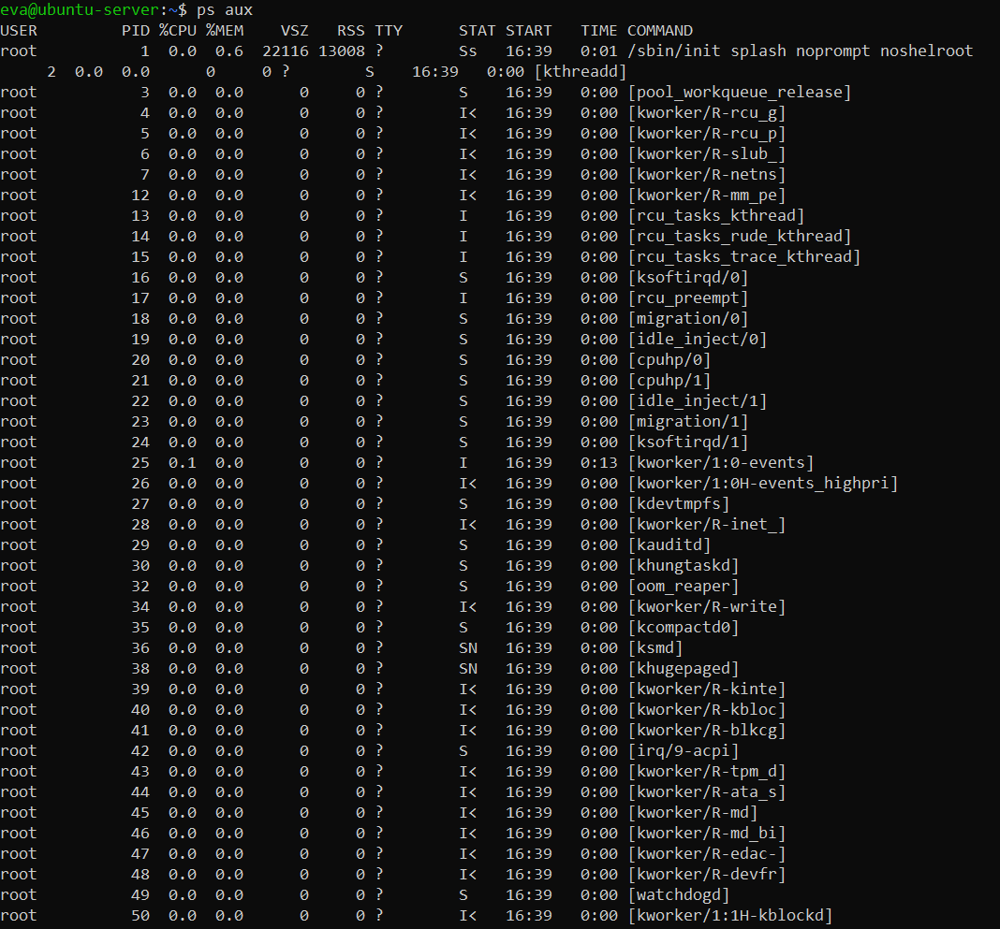
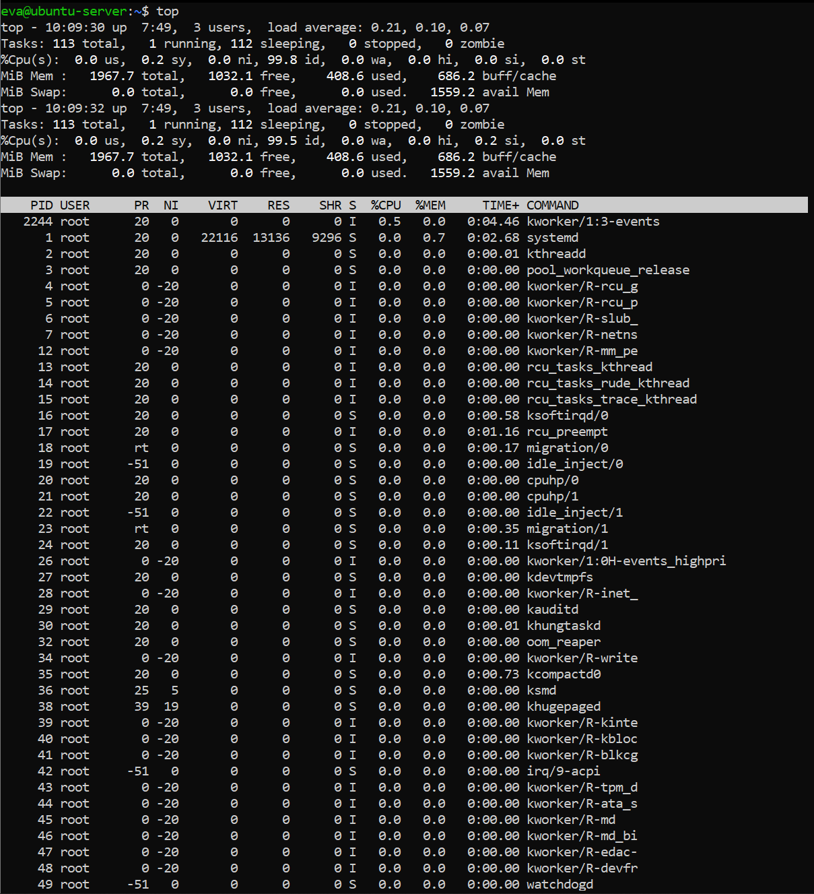
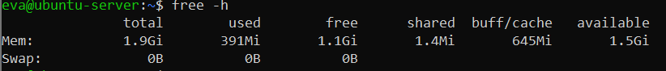
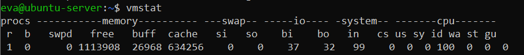
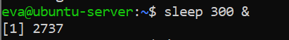
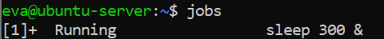
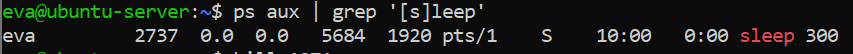
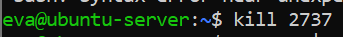

Week 3 – Process Management and System Monitoring
Overview

This week focused on understanding how Linux manages processes and system resources at runtime. The aim was to observe active processes, monitor CPU and memory usage, manage background jobs, and control processes using command-line tools. All observations were carried out on the Ubuntu Server virtual machine.

1. Process Listing and Inspection

To examine all running processes on the system, the following command was used:

ps aux

This command displays all processes for all users, including system services and kernel threads. The output showed that most processes were owned by root, which is expected on a server system, as critical services such as systemd, kernel workers (kworker), and device handlers run with elevated privileges.
This demonstrated the separation between user-level processes and core system processes.

2. Real-Time Process Monitoring

To monitor processes dynamically, the top command was used:

top

This tool provides a real-time view of:

CPU usage

Memory usage

Load average

Active and sleeping processes

The system showed a very low load average, confirming that the server was mostly idle. Most CPU time was spent in the idle state, which is typical for a server not under heavy workload.

3. Memory Usage Analysis

Memory usage was examined using:

free -h

The output showed:

Total system memory of approximately 2 GB

A large portion of memory available

No swap space in use

This confirmed that the system was operating efficiently and was not under memory pressure.

4. Virtual Memory and CPU Statistics

To observe low-level system statistics, the following command was used:

vmstat

This provided insight into:

CPU activity

Context switches

Memory buffering and caching

Swap usage

The results showed no swap activity and minimal CPU load, further confirming stable system performance.

5. Background Jobs and Process Control

A background process was created using:

sleep 300 &

This command launched a process that runs in the background for 300 seconds.

The running job was verified using:

jobs

6. Identifying and Terminating a Process

To locate the background sleep process, the following command was used:

ps aux | grep '[s]leep'

This technique avoids matching the grep process itself and correctly identifies the target process along with its PID.

The process was terminated using:

kill <PID>

After termination, the process no longer appeared in the process list, confirming successful process control.

Reflection

This week provided practical insight into how Linux manages processes and system resources. Learning how to interpret ps, top, and vmstat outputs made it easier to understand system behaviour in real time. Managing background jobs and terminating processes reinforced core system administration skills that are essential for server maintenance and troubleshooting.
