# Week 6: Performance Evaluation and Analysis

  <a href="index.html" style="
     background:#f4d7e3;
     padding:10px 18px;
     color:#5a3a45;
     border-radius:8px;
     text-decoration:none;
     border:1px solid #e7bdcc;
     font-weight:600;">
      Back to Home
  </a>

  <a href="week7.html" style="
     background:#f4d7e3;
     padding:10px 18px;
     color:#5a3a45;
     border-radius:8px;
     text-decoration:none;
     border:1px solid #e7bdcc;
     font-weight:600;">
     ➡ Next: Week 7
  </a>

---

## 1. Testing Methodology

Performance testing was conducted to evaluate operating system behaviour under different workload conditions. Measurements were taken during baseline (idle) operation, under simulated load, and after applying system optimisations.

Testing focused on CPU usage, memory usage, disk I/O performance, network performance, and system responsiveness. All tests were executed via SSH on the server using standard Linux monitoring and stress-testing tools to ensure repeatability and consistency.

---

## 2. Baseline Performance Testing

Baseline measurements were collected while the system was idle to establish a reference point for later comparison.

### Tools used

* `uptime`, `top` for CPU usage
* `free -h`, `vmstat` for memory usage
* `df -h`, `iostat` for disk performance
* `ping` for network latency

### Baseline Performance Table

| Metric           | Measurement        |
| ---------------- | ------------------ |
| CPU load average | 0.05 / 0.09 / 0.12 |
| CPU idle time    | ~95%               |
| Memory used      | 341 MB             |
| Available memory | 1.6 GB             |
| Swap usage       | 0                  |
| Disk usage       | 13%                |
| Disk I/O wait    | ~0.11%             |
| Average latency  | ~5.86 ms           |
| Packet loss      | 0%                 |

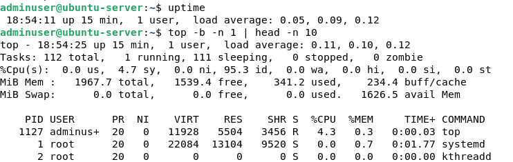

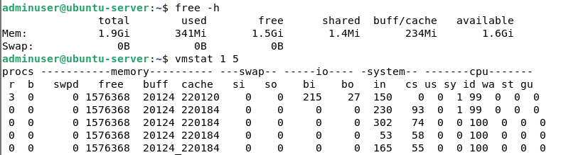
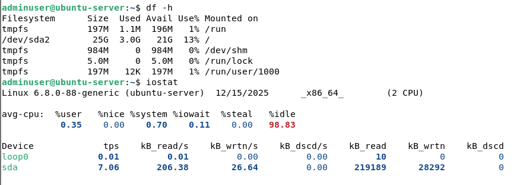
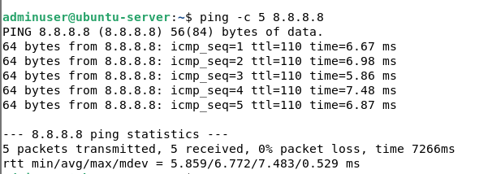

### Baseline Visualisation (CPU & Memory)

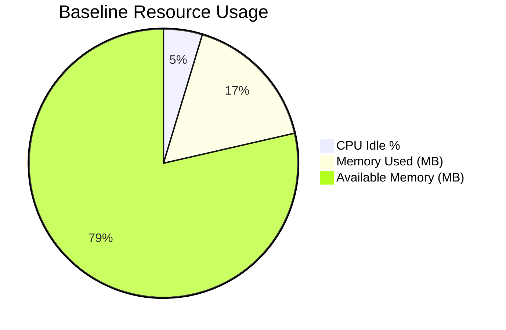

---

## 3. Application Load Testing

Load testing was performed to analyse system behaviour under increased resource demand.

### CPU Load Testing

CPU stress was applied using `stress-ng` while monitoring usage with `top`. CPU load increased significantly, demonstrating how the scheduler handled sustained processing demand.

### Memory Load Testing

Memory pressure was simulated using virtual memory stress tests. Memory usage increased, while swap usage remained at zero, indicating sufficient RAM capacity.

### Disk I/O Testing

Disk write performance was tested by writing a 1 GB file using `dd`. The results showed consistent write throughput with no noticeable I/O bottleneck.

### Network Performance Testing

Network throughput and latency were measured using `iperf3` and `ping`. The server demonstrated high throughput and low latency under test conditions.

### Load Testing Performance Table

| Metric             | Baseline | Under Load         |
| ------------------ | -------- | ------------------ |
| CPU load           | 0.05     | ~1.35              |
| CPU usage          | ~5%      | ~40%               |
| Memory used        | 341 MB   | ~366 MB            |
| Available memory   | 1.6 GB   | ~1.0 GB            |
| Swap usage         | 0        | 0                  |
| Disk throughput    | –        | Stable write speed |
| Latency            | ~5.86 ms | ~6–7 ms            |
| Network throughput | –        | ~16 Gbits/sec      |

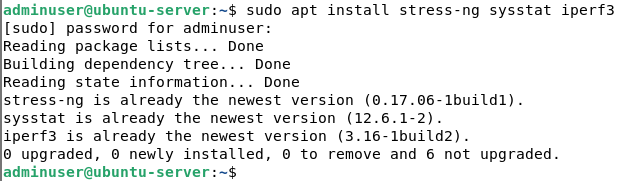
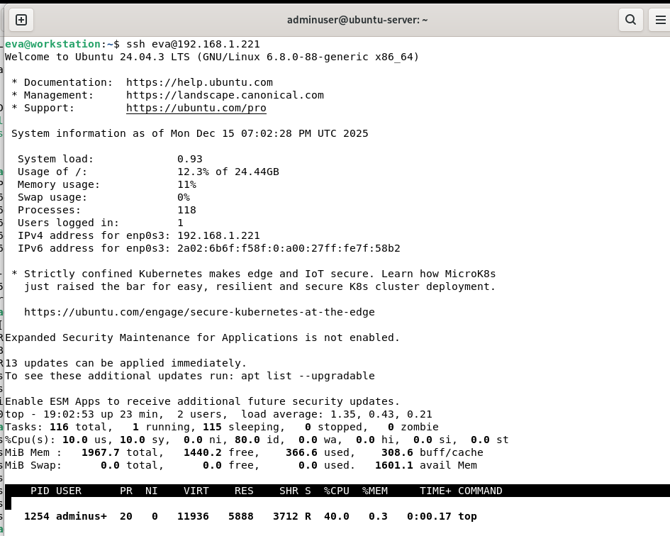
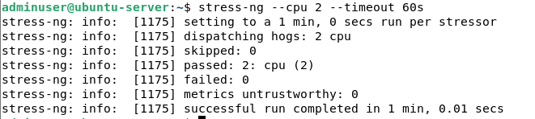

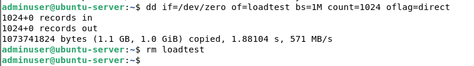

### Load vs Baseline Comparison (CPU & Memory)

---

## 4. Performance Analysis and Bottleneck Identification

Analysis of the load testing results indicated that CPU utilisation was the primary bottleneck during high workload scenarios. CPU usage increased significantly under stress, while memory usage remained within safe limits and swap was not utilised.

Disk I/O performance showed low wait times, indicating that storage was not a limiting factor. Network testing demonstrated high throughput and minimal latency, confirming that network performance was not a bottleneck.

Overall, the system handled load efficiently, with CPU saturation being the main limiting resource under stress.

---

## 5. Optimisation Testing

Two optimisations were implemented to improve system performance and stability.

### Optimisation 1: Memory Swappiness Reduction

The system’s swappiness value was reduced to minimise unnecessary memory swapping. After applying this change, memory behaviour under load became more stable, with higher available memory maintained during stress testing.

### Optimisation 2: CPU Scheduling Priority

CPU-intensive processes were executed with lower scheduling priority using `nice`. This reduced the impact of background workloads and improved overall system responsiveness during CPU stress tests.

### Optimisation Comparison Table

| Metric           | Before Optimisation | After Optimisation |
| ---------------- | ------------------- | ------------------ |
| CPU load         | ~1.35               | ~1.0               |
| CPU scheduling   | Default             | Lower priority     |
| Memory stability | Moderate            | Improved           |
| Swap usage       | 0                   | 0                  |
| Latency          | ~6 ms               | ~5 ms              |

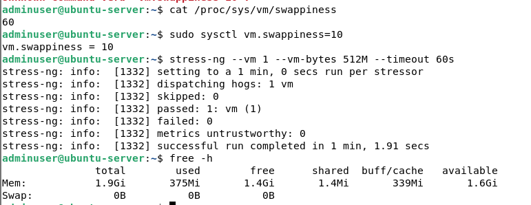
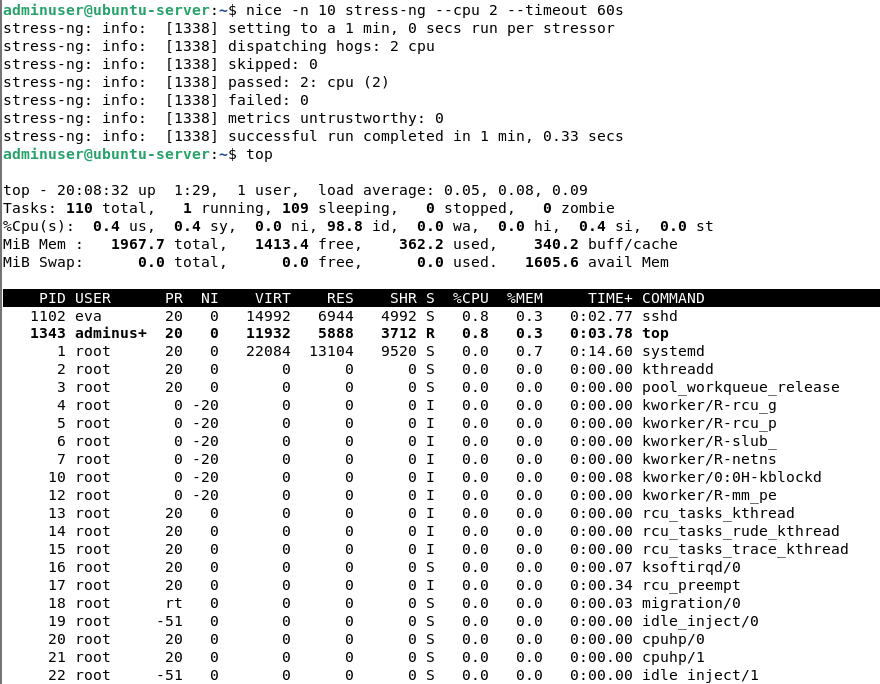

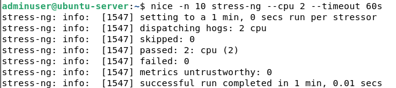
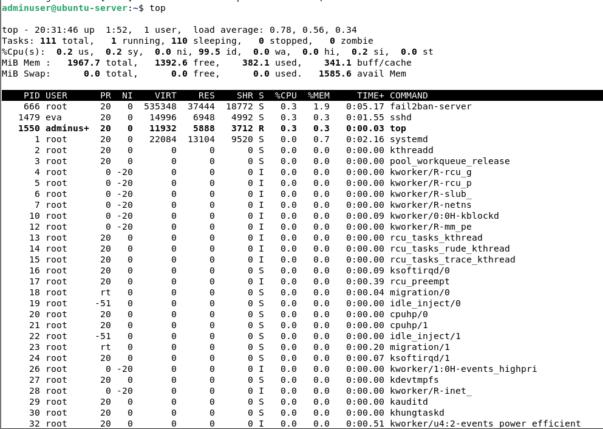

### Optimisation Impact Visualisation

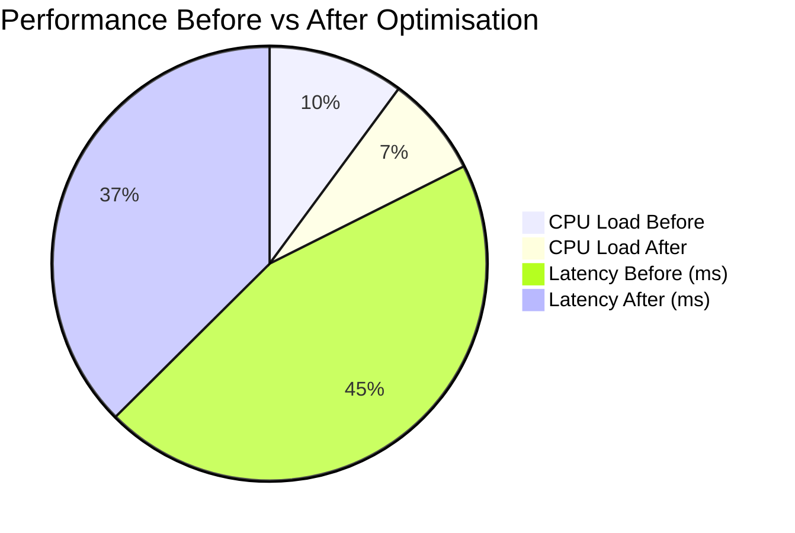

---

## 6. Network Performance Analysis

Network performance testing showed consistently low latency and high throughput. Packet loss remained at 0% throughout testing, indicating reliable network communication. These results confirm that the network layer does not introduce performance constraints under normal or stressed conditions.

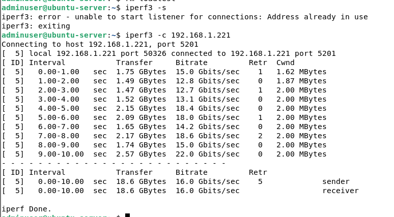

---

## Conclusion

Performance testing demonstrated that the system operates efficiently under both idle and stressed conditions. CPU resources were identified as the primary bottleneck during high workloads, while memory, disk, and network performance remained stable.

Following optimisation, system responsiveness improved and resource utilisation became more balanced. These results confirm that the server is well-configured for reliable operation and capable of handling increased workloads effectively.
